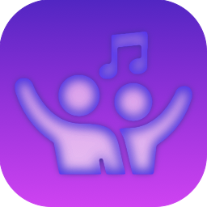
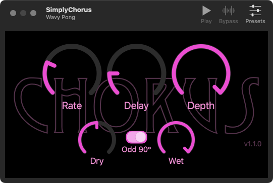

[](https://github.com/bradhowes/SimplyChorus/actions/workflows/CI.yml)
[](https://swift.org)
[](https://developer.apple.com/documentation/audiounit)
[](https://opensource.org/licenses/MIT)



# About SimplyChorus

This is an AUv3 audio component for both iOS and macOS platforms that generates the classic chorusing effect. The
app for each platform embeds in the app bundle an app extension containing the AUv3 component. The apps are designed
to load the AUv3 component the same was as a host such as GarageBand would. It uses the app extension to
demonstrate how the component works  by playing a sample audio file and routing it through the effect and out to
the device's speaker.



Additional features and info:

* Uses a C++ kernel to generate audio samples in the render thread
* Provides a *very* tiny Objective-C (Objective-C++ really) wrapper for access to the kernel from Swift code
* Uses Swift for all UI and all audio unit work not associated with sample rendering

The code was developed in Xcode 13 on macOS 12. I have tested on both macOS and iOS devices primarily in
GarageBand, but also using test hosts on both devices as well as the excellent
[AUM](https://apps.apple.com/us/app/aum-audio-mixer/id1055636344) app on iOS.

Finally, it passes all
[auval](https://developer.apple.com/library/archive/documentation/MusicAudio/Conceptual/AudioUnitProgrammingGuide/AudioUnitDevelopmentFundamentals/AudioUnitDevelopmentFundamentals.html)
tests:

```
% auval -v aufx chor BRay
```

Here `chor` is the unique component subtype for the effect and `BRay` is my own manufacturer ID. You should use
your own values that you put in [Configuration/Common.xcconfig](Configuration/Common.xcconfig).

Note that to successfully compile you will need to edit
[Configuration/Common.xcconfig](Configuration/Common.xcconfig) and change `DEVELOPMENT_TEAM` to hold your own
Apple developer account ID so you can sign the binaries. You should also adjust other settings as well to
properly identify you and/or your company.

> :warning: You are free to use the code according to [LICENSE.md](LICENSE.md), but you must not replicate
> someone's UI, icons, samples, or any other assets if you are going to distribute your effect on the App Store.

# App Targets

The macOS and iOS apps are simple AUv3 hosts that demonstrate the functionality of the AUv3 component. In the
AUv3 world, an app serves as a delivery mechanism for an app extension like AUv3. When the app is installed, the
operating system will also install and register any app extensions found in the app.

The apps attempt to instantiate the AUv3 component and wire it up to an audio file player and the output
speaker. When it runs, you can play the sample file and manipulate the effects settings in the components UI.

# Code

Each OS ([macOS](macOS) and [iOS](iOS)) have the same code layout:

* `App` -- code and configury for the application that hosts the AUv3 app extension
* `Extension` -- code and configury for the extension itself. It contains the OS-specific UI layout
  definitions.

Note that the signal processing code is to be found in the
[ChorusKernel](https://github.com/bradhowes/ChorusKernel) Swift package; the targets in this repo contain the
user interface for the signal processing kernel and audio unit runtime parameters. The "knobs" of the interface
are provided by [another Swift package](https://github.com/bradhowes/knob).

# Dependencies

This code now depends on two Swift packages:

- [AUv3Support](https://github.com/bradhowes/AUv3Support) -- common AUv3 component and host code. Much of the code that
was originally in a shared framework in this repo is now in this separate package.
- [Knob](https://github.com/bradhowes/knob) -- a simple library for macOS and iOS that generates rotary "knob"
controls using Core Animation layers.
- [ChorusKernel](https://github.com/bradhowes/ChorusKernel) -- the signal processing kernel and runtime
parameters for the chorus effect.
